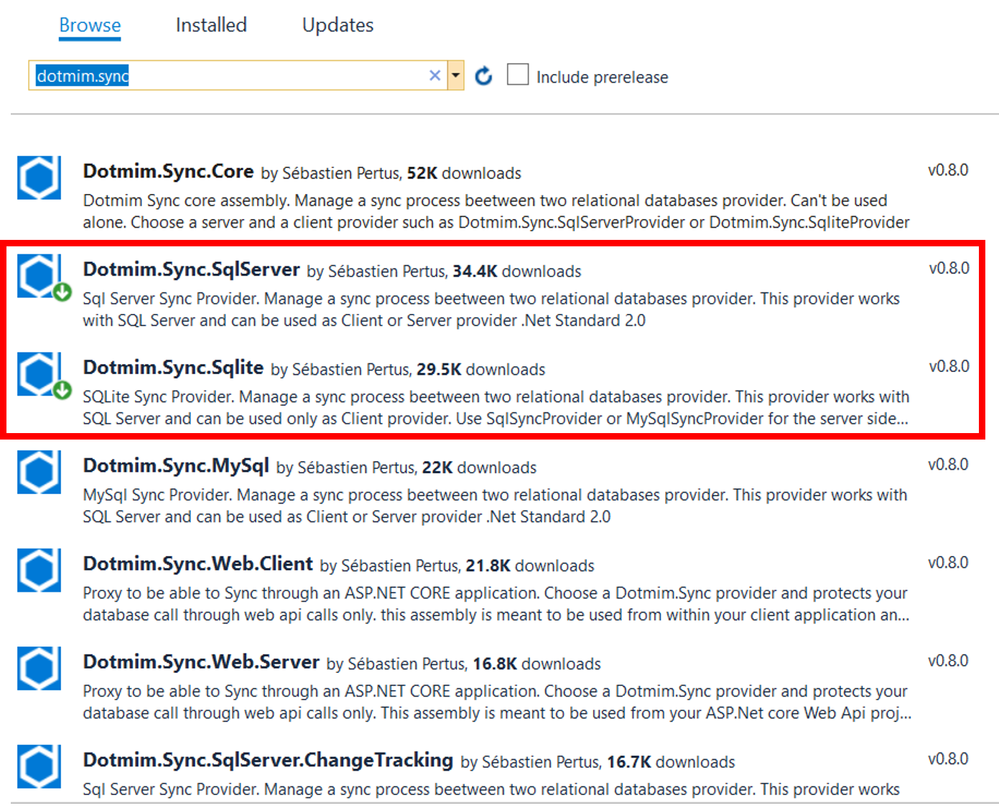
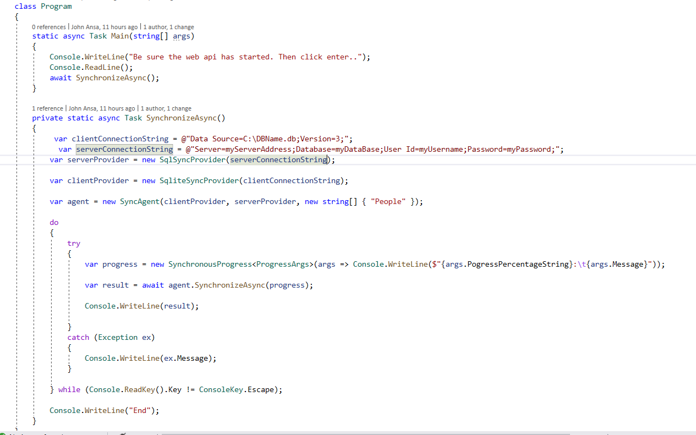
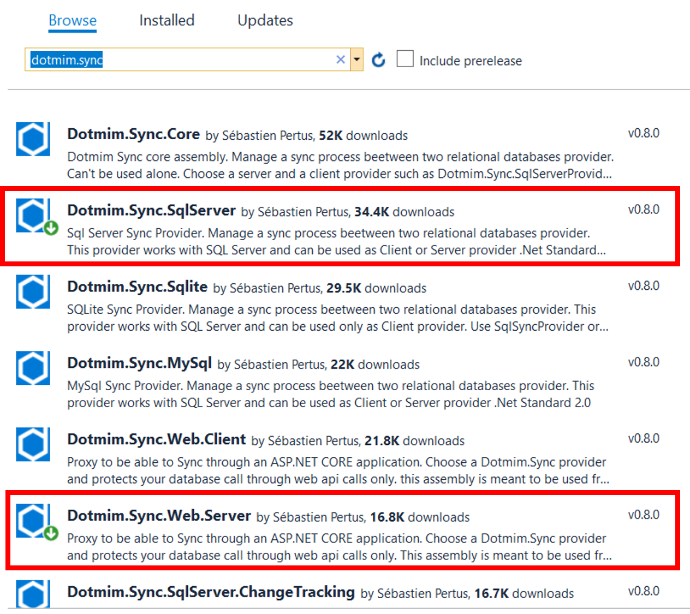
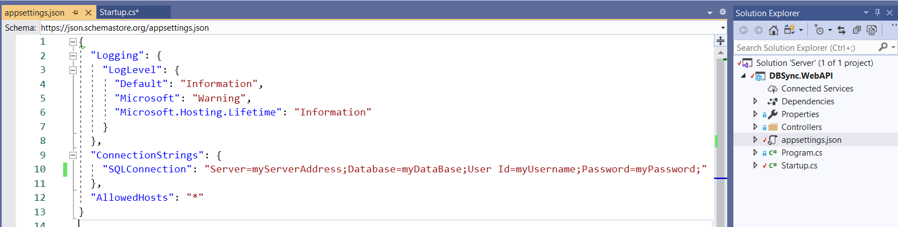
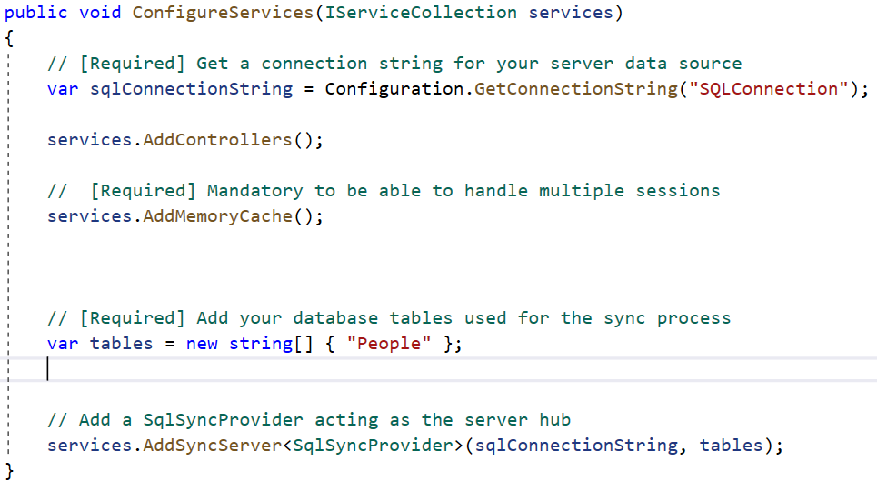
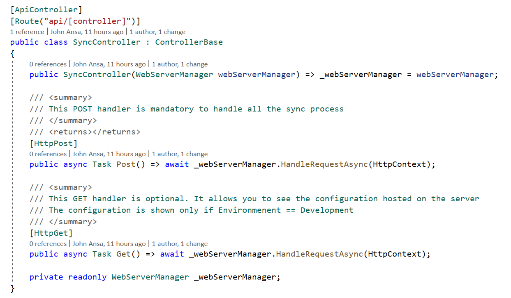
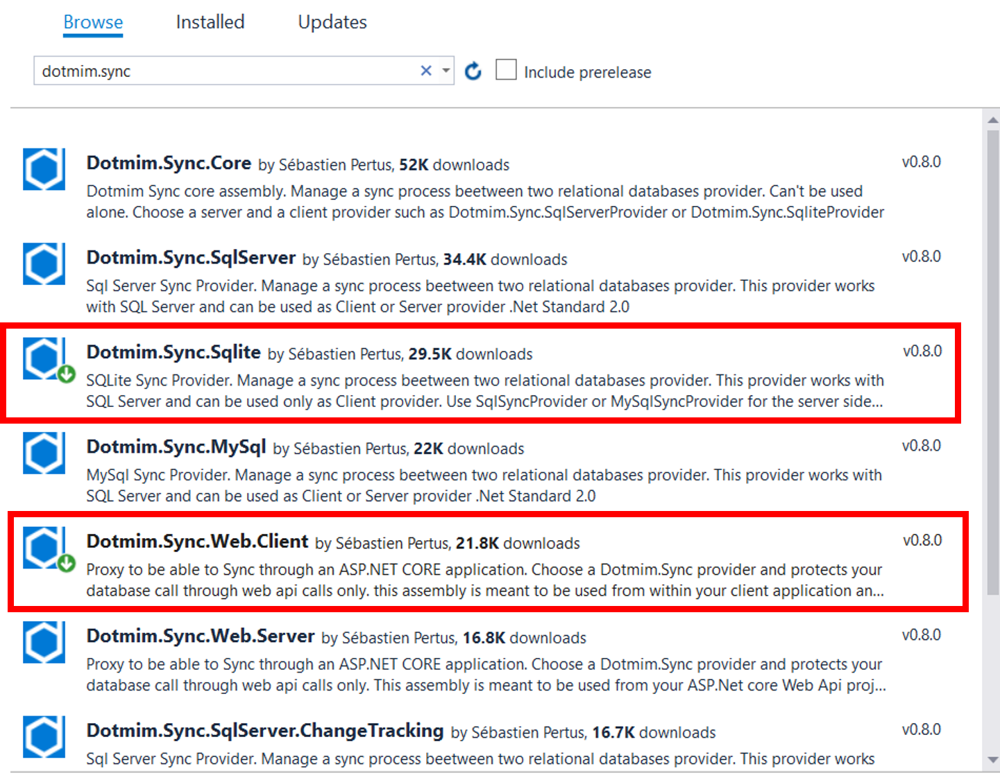
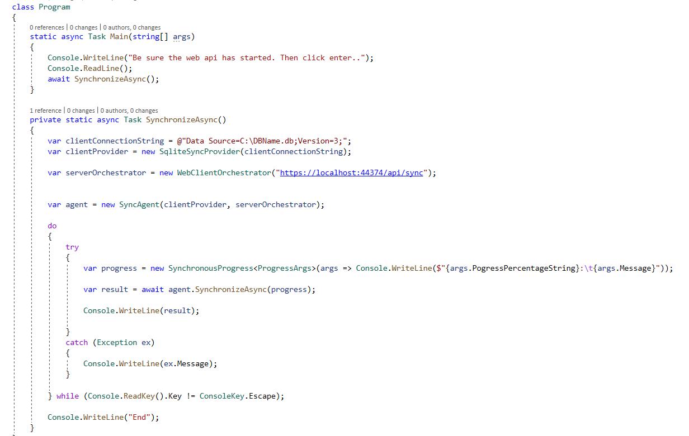

# DBSync
An example database Bi-Directional synchronization using DotMim.Sync (DMS) with Web API

**DotMim.Sync**  (**DMS**) is an easy to use framework for syncing relational databases, written in  **.Net Standard 2.0**.

DotMim.Sync is available for syncing  **SQL Server**,  **MySQL**,  **MariaDB**  and  **Sqlite**  databases. Learn more about DotMim.Sync [here](https://dotmimsync.readthedocs.io/ "DotMim.Sync Framework ").

This example application shows how relational databases can be synchronize using DotMim.Sync framework. In this example, the client database is set up to used SQLite while the server database has been configured to use SQL Server.

On the Client side, we have two Console applications that sync the client local database with the server database and vice versa. This is Bi-directional sync and conflicts get resolve by DotMim.Sync framework. 

The Web API will be deployed on the Server-side which will be consumed by the client app.

## Console App
 1. Setup your **SQL Server** and **SQLite** databases and populate any or both of them with records.
 2. Create a Console App and install the following packages form Nuget.
	 - Dotmim.Sync.SqlServer
	 - Dotmim.Sync.Sqlite
	 
	 Image 1: Nuget packages for SQL Server and SQLite databases synchronization
 3. Implement the Sync as shown in image 2 below.
      
      Image 2: Nuget packages for SQL Server and SQLite databases synchronization

## Web API
### Server Side Setup
 1. Setup your **SQL Server** database same.
 2. Create a Web API project and install the following packages form Nuget.
	 - Dotmim.Sync.SqlServer
	 - Dotmim.Sync.Web.Server
	 
	 Image 3: Nuget packages for SQL Server and Web Server
 3. Configure SQL Server database connection string in the `appsettings.jon` file.
      
      Image 4: Connection string configured in the `appsettings.jon`
 4. Configure `SqlSyncProvider` in the **Startup.cs**  as shown in image 5.
      
      Image 5: Connection string configured in the `appsettings.jon`
 5. Create a **SyncController.cs** file in the Controller folder and implement it as shown in image 6.
      
      Image 6: Connection string configured in the `appsettings.jon`

### Client Side Setup
1. Setup your **SQLite** database.
 2. Create a Console App and install the following packages form Nuget.
	 - Dotmim.Sync.Sqlite
	 - Dotmim.Sync.Web.Client
	 
	 Image 7: Nuget packages for SQLite client-side setup
 3. Implement the Synchronization as shown in image 8 below.
      
      Image 8: Nuget packages for SQLite and Web Client.
      
      ### Database Synchronization
      1. Run the server Web API and route to https://localhost:44394/api/sync
      2. Run the client Console App and press `Enter` key on your keyboard.

**That's it!**

### **DotMim.Sync**  (**DMS**)  Features
Below are some of the features available in **DotMim.Sync** 
-   Multi databases support (SQL Server, MYSQL, SQLite)
-   Conflict resolution
-   Snapshot initialization
-   Filters
-   Custom serializers
-   Mode TCP and HTTP through ASP.NET Core Web API
-   Sync Direction (Bidirectional, DownloadOnly, UploadOnly)
-   SQL Server only: Support of change tracking/bulk operations with TVP

**Documenation:** [DotMim.Sync Official Documentaion](https://dotmimsync.readthedocs.io/ "DotMim.Sync Framework ").
**Source Code:** [DotMim.Sync Source Code](https://github.com/Blogrammer/Dotmim.Sync "DotMim.Sync Framework ").
**More Code Examples:** [DotMim.Sync Samples](https://github.com/Mimetis/Dotmim.Sync/tree/master/Samples "DotMim.Sync Framework ").
